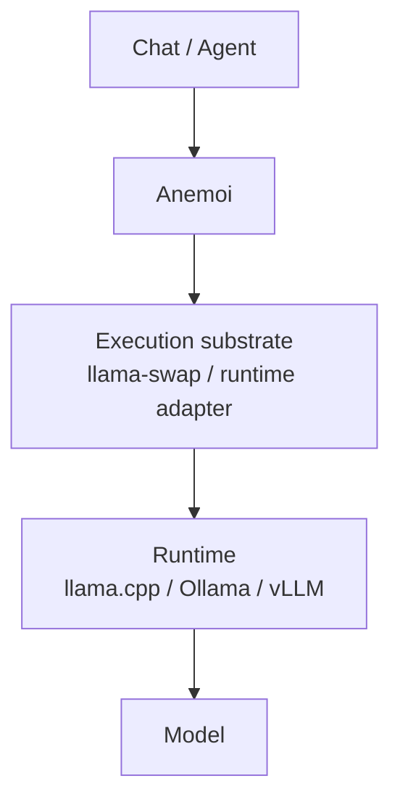
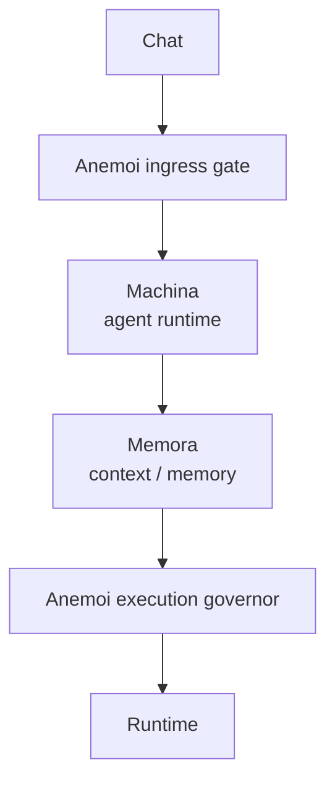
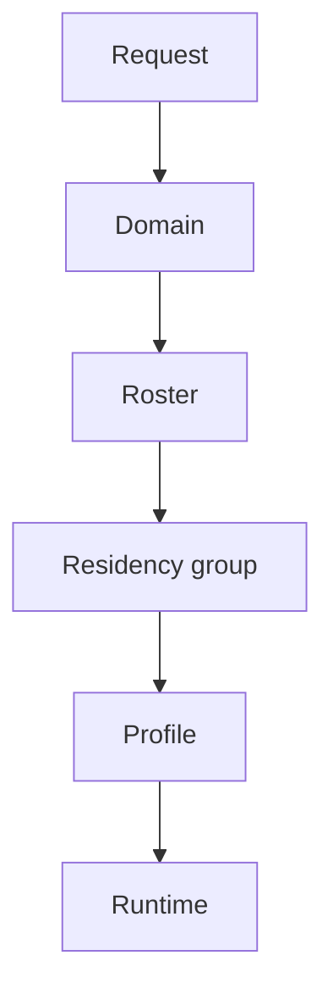
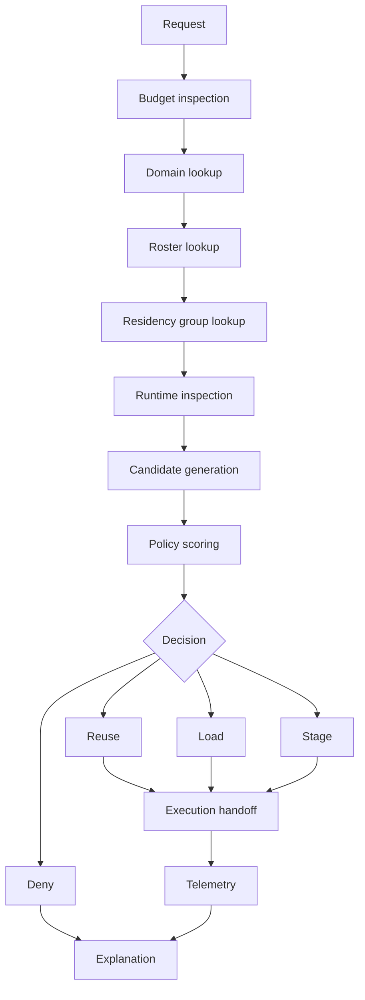

# Anemoi

Anemoi is a local-first inference governance daemon for heterogeneous AI
systems.

```text
Anemoi decides.
Runtimes execute.
```

The Rust rewrite focuses on residency-aware decision making before
provider-gateway behavior. The first version inspects runtime state, evaluates
policy, chooses an execution path, and records a structured explanation.

## Status

| Field | Value |
|---|---|
| Project shape | Local inference governance daemon |
| Language | Rust |
| Core behavior | Runtime inspection, residency scoring, continuity decisions |
| API surface | Axum daemon |
| CLI surface | `anemoi` |
| MCP surface | Minimum local control-plane adapter |
| Config | `config/anemoi.example.yaml` |
| Decision log | In-memory by default; optional append-only JSONL |
| Live inference forwarding | Partial; full forwarding is deferred |
| Provider gateway behavior | Out of core v1 |

## Current Repository State

Repository evidence as of 2026-05-24:

| Item | Current state |
|---|---|
| Rust workspace | `Cargo.toml` with `crates/anemoi-*` members |
| Example config | `config/anemoi.example.yaml` |
| Legacy files | `src/Anemoi.*` and `Anemoi.sln` are still present |
| Legacy status | `Needs validation` |

Do not treat the legacy .NET surface as removed or migrated. Deletion,
migration, or compatibility work needs explicit scope.

## Product Boundary

Anemoi owns:

- Runtime selection.
- Residency governance.
- Continuity preservation.
- Execution economics.
- Deterministic scheduling decisions.
- Structured explanations.
- Decision telemetry.

Anemoi does not own:

- Inference execution internals.
- Model weights.
- Agent planning.
- Memory.
- Retrieval.
- Training.
- Tool orchestration.
- Provider gateway behavior in core v1.

## System Position



Optional future stack:



## Scheduling Model

Anemoi schedules against residency groups, not raw model names.



The scheduler pipeline:



## Workspace

| Crate | Responsibility |
|---|---|
| `crates/anemoi-core` | Shared domain types, config, residency states, decisions, explanations. |
| `crates/anemoi-runtime` | Runtime adapter trait, mock adapter, Ollama inspect adapter, llama-swap inspection adapter, and HTTP inspect stubs for llama.cpp. |
| `crates/anemoi-policy` | Deterministic scheduler, scoring, continuity fallback behavior. |
| `crates/anemoi-telemetry` | Recent in-memory decisions and optional append-only JSONL logging. |
| `crates/anemoi-daemon` | Axum control-plane API. |
| `crates/anemoi-cli` | `anemoi status`, `anemoi decide`, `anemoi explain`, `anemoi residents`, `anemoi runtimes`, `anemoi policy check`. |
| `crates/anemoi-mcp` | Minimum MCP-facing adapter for status, residents, decide, explain, and policy check. |

## API

| Endpoint | Purpose |
|---|---|
| `GET /health` | Basic daemon health. |
| `GET /status` | Runtime and policy summary. |
| `GET /residents` | Current normalized residency view. |
| `POST /decide` | Return a decision without executing inference. |
| `POST /execute` | Decide, record the decision, and return an explicit model-load handoff response. |
| `GET /decisions/:id` | Fetch a recorded decision. |
| `GET /explain/:id` | Fetch the explanation for a recorded decision. |
| `GET /openapi.json` | Fetch the OpenAPI contract. |

Full inference forwarding belongs to a later runtime-adapter pass. In v1,
`/execute` reports `full_inference_forwarded: false`.

## Configuration

Default config path:

```text
config/anemoi.example.yaml
```

Override at runtime:

```powershell
$env:ANEMOI_CONFIG = "config/anemoi.example.yaml"
$env:ANEMOI_BIND = "127.0.0.1:7070"
$env:ANEMOI_DECISION_LOG = "logs/anemoi-decisions.jsonl"
```

Phase one does not require a database. Recent decisions are kept in process
memory. Set `ANEMOI_DECISION_LOG` only when an append-only JSONL trail is useful.
`/explain/:id` and `/decisions/:id` can only find recent in-memory decisions;
JSONL replay is deferred.

The example config defines:

- a `coding` domain
- `small_swarm` and `large_models` residency groups
- mock runtime-backed model profiles
- a hot `qwen9b` mock resident for the continuity demo
- continuity policy that prefers degraded response over blank waits

## Run

Start the daemon:

```powershell
cargo run -p anemoi-daemon
```

Run CLI commands:

```powershell
cargo run -p anemoi-cli -- status
cargo run -p anemoi-cli -- decide --domain coding --latency-budget-ms 1500
cargo run -p anemoi-cli -- residents
cargo run -p anemoi-cli -- runtimes
cargo run -p anemoi-cli -- policy check
```

OpenAPI:

```powershell
curl http://127.0.0.1:7070/openapi.json
```

## Test

```powershell
cargo test --workspace
```

The core proof test verifies the first continuity behavior: when a large model
would cold-load and a smaller worker is already hot, Anemoi selects the hot
worker and records the larger model as a background stage target.

## First Proof Of Value

The first useful Anemoi behavior is not routing a prompt.

The first useful behavior is:

```text
Anemoi avoided loading a large cold model,
reused a hot acceptable worker,
kept interaction responsive,
staged the larger model only when policy allowed,
and explained the decision.
```

## Explicit Deferrals

- Full inference forwarding.
- Cloud API routing.
- Provider gateway behavior.
- Agent planning.
- Memory or RAG behavior.
- Multi-node scheduling.
- Legacy .NET deletion or migration.
- SQLite and database-backed analytics.

## References

- `AGENTS.md`
- `CONTRIBUTING.md`
- `config/anemoi.example.yaml`
- `docs/handoff.md`
- `docs/test_roadmap.md`
