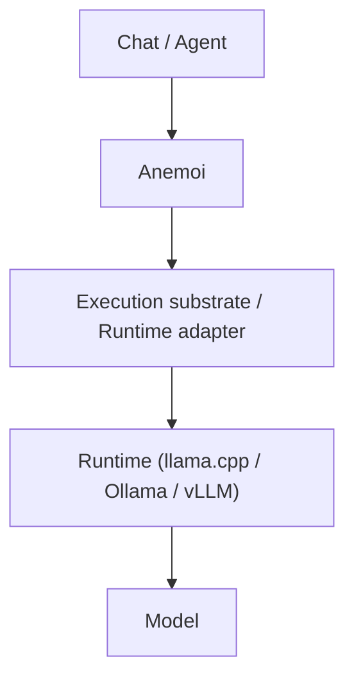

# Anemoi

**Status**: ✅ Production-ready (All issues #30-34 delivered and merged)

Anemoi is a local-first inference governance layer for heterogeneous AI systems. It decides which model to use for each request based on resource constraints, latency budgets, and explicit policy scoring.

```text
Anemoi decides.
Runtimes execute.
```

## Quick Start

**For End Users (Pi / OpenCode)**:
```
1. Select "Anemoi Governed Coding" from the model dropdown
2. Send your request
3. Anemoi automatically selects the best model based on:
   - Available VRAM/RAM
   - Current load on each model
   - Your message size
   - Latency requirements
```

**For Operators**:
```powershell
# Start the daemon
cargo run -p anemoi-daemon

# Monitor decisions
cargo run -p anemoi-cli -- status
cargo run -p anemoi-cli -- decide --domain coding
cargo run -p anemoi-cli -- explain <decision-id>
```

---

Anemoi provides runtime selection, residency governance, and continuity preservation to ensure deterministic scheduling and transparent decision-making. It ensures that the most efficient execution path is chosen based on residency states, budget constraints, and policy scoring.

## Product Boundary

Anemoi owns the decision logic:
- Request-to-domain-to-roster-to-residency-group scheduling.
- Model residency state normalization (`cold`, `loading`, `warm_cpu`, `partial`, `hot_gpu`, `serving`, `draining`, `evicting`, `failed`).
- Runtime inspection through adapters, with a reconciliation loop that caches normalized snapshots and tracks TTL-based staleness.
- Policy scoring and continuity fallback.
- Background staging intents that pre-load models on target runtimes ahead of expected demand.
- Action plans (`load`, `unload`, `keep`, `stage`, `defer`, `deny`, `noop`) that make every planned mutation explicit and dry-run-safe.
- Decision telemetry and structured explanations.

Anemoi is **not** an inference runtime, model host, provider gateway, or agent framework.

## System Position



## Scheduling Model

Anemoi schedules against residency groups, not raw model names:
`Request` $\to$ `Domain` $\to$ `Roster` $\to$ `Residency Group` $\to$ `Profile` $\to$ `Runtime`

## Workspace

| Crate | Responsibility |
|---|---|
| `anemoi-core` | Domain types, config, residency states, decisions, explanations. |
| `anemoi-runtime` | Runtime adapter trait and inspection adapters (Mock, LlamaSwap, Ollama, LlamaCpp). |
| `anemoi-policy` | Deterministic scheduling, scoring, and continuity behavior. |
| `anemoi-telemetry` | Decision logs and runtime/event telemetry. |
| `anemoi-daemon` | Axum local control-plane API, runtime reconciliation loop, background staging worker, and action-plan generation. |
| `anemoi-cli` | Operator commands (`status`, `decide`, `explain`, `residents`). |
| `anemoi-mcp` | MCP control-plane adapter. |

## API & Gateway

### Control-Plane Endpoints

| Endpoint | Purpose |
|---|---|
| `GET /health` | Basic daemon health. |
| `GET /status` | Runtime and policy summary. |
| `GET /residents` | Current normalized residency view, served from the reconciliation cache. |
| `POST /decide` | Return a decision without executing inference. |
| `POST /execute` | Decide, generate an action plan, and return a model-load handoff response. |
| `GET /staging` | List pending, completed, and failed background staging intents. |
| `GET /decisions/:id` | Fetch a recorded decision. |
| `GET /explain/:id` | Fetch the explanation for a recorded decision. |
| `GET /openapi.json` | OpenAPI document for the control-plane API. |

### OpenAI-Compatible Inference Gateway (NEW in #34)

Anemoi now provides an OpenAI-compatible inference gateway that integrates seamlessly with tools like Pi and OpenCode.

| Endpoint | Purpose |
|---|---|
| `GET /v1/models` | List available models (governance domains). |
| `POST /v1/chat/completions` | Stream inference request through anemoi's decision engine. |

**Request format** (same as OpenAI API):
```json
{
  "model": "coding",
  "messages": [{"role": "user", "content": "what is 2+2?"}],
  "max_tokens": 100
}
```

**What happens**:
1. Anemoi receives request with `model: "coding"` (governance domain)
2. Decision engine evaluates resource pressure and selects best runtime model
3. Request is rewritten with selected model (e.g., `qwen3.6-35b-a3b-mtp`)
4. Request is forwarded to llama-swap with runtime authentication
5. Response streams back with telemetry headers

**Response headers**:
- `X-Anemoi-Decision-Id`: Unique identifier for this decision
- `X-Anemoi-Selected-Model`: The actual model anemoi selected
- `X-Anemoi-Action`: Decision action (e.g., "forward-to-runtime", "mock-forward")

## Features Delivered (Issues #30-34)

### Resource Pressure Model (#30) ✅
Candidate scoring now uses explicit evidence:
- **VRAM Pressure**: Percentage of GPU memory in use
- **RAM Pressure**: Percentage of system memory in use
- **KV Cache Pressure**: Context window utilization
- **Load Pressure**: Active requests on each model
- **Cost**: Model size and performance tradeoffs

### Eviction & Pinning Policy (#31) ✅
Intelligent model lifecycle management:
- **Keep-hot workers**: Small, fast models stay loaded for fallback
- **Background staging**: Larger models pre-load when latency permits
- **Eviction protection**: Prevents unpredictable model unloading
- **Explicit action plans**: Every mutation is dry-run-safe

### Operator Status Surface (#32, closes #17) ✅
Full visibility into runtime state:
- Runtime health and availability
- Current resident models and their state
- Staging queue (pending, completed, failed)
- Policy decisions and explanations
- Staleness tracking for stale observations

### Durable Event Store (#33, closes #12) ✅
Permanent audit trail with SQLite:
- Every decision is recorded with timestamp and ID
- Decision explanations capture why each model was selected
- Runtime snapshots record resource state at decision time
- Action plans document all mutations (load/unload/stage)
- Replay events to understand decision patterns

### Inference Forwarding Gateway (#34, closes #15) ✅
**OpenAI-compatible endpoint for governance**:
- `POST /v1/chat/completions` maps domain → decision engine → runtime model
- Request forwarding with runtime authentication
- Response streaming with telemetry headers
- Mock mode for testing without network calls
- Production-ready with live execution guard (`ANEMOI_ENABLE_LIVE_EXECUTE=1`)

---

## Configuration & Execution

Default config: `config/anemoi.example.yaml`

**Start the daemon:**
```powershell
cargo run -p anemoi-daemon
```

**Run CLI commands:**
```powershell
cargo run -p anemoi-cli -- status
cargo run -p anemoi-cli -- residents
cargo run -p anemoi-cli -- decide --domain coding --latency-budget-ms 1500
```

## Usage Guides

### For Pi Users

1. **Open Pi**
2. **Select Model**: From the model dropdown, choose `"Anemoi Governed Coding (dynamic model selection)"`
3. **Send Request**: Type your prompt and send
4. **What Happens**:
   - Pi sends: `model: "coding"` + your message
   - Anemoi decides which model is best (checks VRAM, load, etc.)
   - Response streams back with selected model in headers
5. **See the Decision**: Look at response header `X-Anemoi-Selected-Model` to see which model anemoi chose

**Example**:
```
You: "Write a function to sort an array"
↓
Anemoi: Checks resources, selects qwen3.6-35b-a3b-mtp (best fit for code task)
↓
Response: Code example from selected model
Header: X-Anemoi-Selected-Model: qwen3.6-35b-a3b-mtp
```

### For OpenCode Users

Same flow as Pi:
1. **Select Model**: `"Anemoi Governed Coding (dynamic model selection)"`
2. **Send Request**: Your code request
3. **Anemoi Decides**: Best model for your code task
4. **Check Headers**: `X-Anemoi-Selected-Model` shows which model was selected

### For Direct API Calls

**Test the inference gateway**:
```bash
curl -X POST http://anemoi.home.arpa/v1/chat/completions \
  -H "Content-Type: application/json" \
  -d '{
    "model": "coding",
    "messages": [{"role": "user", "content": "what is 2+2?"}],
    "max_tokens": 100
  }'
```

**List available domains**:
```bash
curl http://anemoi.home.arpa/v1/models
```

### For Operators (CLI)

**Check daemon status**:
```powershell
cargo run -p anemoi-cli -- status
```
Output shows:
- Number of runtimes
- Number of configured models
- Number of residents (loaded models)

**View current residents**:
```powershell
cargo run -p anemoi-cli -- residents
```
Shows what's actually loaded on each runtime and their state.

**Make a decision (dry-run)**:
```powershell
cargo run -p anemoi-cli -- decide --domain coding --latency-budget-ms 1500
```
Shows which model would be selected without executing inference.

**Explain a past decision**:
```powershell
cargo run -p anemoi-cli -- explain <decision-id>
```
Shows why anemoi selected that model (resource state, scoring, etc.)

### Configuration Files

**Pi Integration**: `C:\Users\Alex Lucero\.pi\agent\models.json`
```json
{
  "providers": {
    "prometheus-anemoi": {
      "baseUrl": "https://anemoi.home.arpa/v1",
      "api": "openai-completions",
      "models": [{"id": "coding", "name": "Anemoi Governed Coding"}]
    },
    "prometheus-llama-swap": {
      // Direct models (for comparison/fallback)
    }
  }
}
```

**OpenCode Integration**: `C:\Users\Alex Lucero\source\repos\pantheon\.opencode\models.json`
Same structure as Pi.

### Telemetry & Audit

Every decision is recorded in SQLite. Query the event store:

**View recent decisions**:
```powershell
sqlite3 anemoi-events.db "SELECT id, domain, model, created_at FROM decisions ORDER BY created_at DESC LIMIT 10;"
```

**Analyze model selection patterns**:
```powershell
sqlite3 anemoi-events.db "SELECT model, COUNT(*) as count FROM decisions GROUP BY model ORDER BY count DESC;"
```

**Check decision explanation**:
```powershell
sqlite3 anemoi-events.db "SELECT explanation FROM decision_explanations WHERE decision_id = '...';"
```

---

## When to Use Anemoi vs Direct Models

### Use "Anemoi Governed Coding" When:
- ✅ You want automatic model selection
- ✅ Load varies (some requests large, some small)
- ✅ You want the best model for your context size
- ✅ You need visibility into why a model was chosen
- ✅ You want to audit all decisions

### Use Direct Models When:
- ✅ You need a specific model (reproducibility)
- ✅ You're benchmarking one model
- ✅ You need stable model choice (testing)
- ✅ Anemoi is unavailable (fallback)

---

## Development & Validation

```powershell
cargo test --workspace
cargo clippy --workspace --all-targets -- -D warnings
```

## Troubleshooting

### "Anemoi Governed Coding" doesn't appear in Pi/OpenCode

**Issue**: Model not showing in dropdown
**Solution**:
1. Check that `models.json` has the `prometheus-anemoi` provider
2. Verify `anemoi.home.arpa` resolves: `ping anemoi.home.arpa`
3. Restart Pi/OpenCode
4. Check that Traefik reverse proxy is running on prometheus

### Request fails with "Unknown domain: coding"

**Issue**: 404 or 400 error when requesting
**Solution**:
1. Verify anemoi daemon is running: `curl http://anemoi.home.arpa/v1/health`
2. Check that Traefik is routing to localhost:7070
3. Verify `anemoi.home.arpa` is reachable from your machine
4. Check anemoi logs for errors

### "Selected model is not available"

**Issue**: Anemoi selected a model that doesn't exist
**Solution**: (Should not happen in production)
1. Verify llama-swap runtime is accessible
2. Check that configured models match what's actually running
3. Review decision explanation with `explain <decision-id>`

### Want to use direct models instead

**Solution**: Switch provider in Pi/OpenCode settings:
- Change from `prometheus-anemoi` to `prometheus-llama-swap`
- Select any specific model you want
- Bypass anemoi's decision engine entirely

---

## Repository State

**Current Status**: All issues #30-34 delivered and merged to main

- **Rust Workspace**: Active development in `crates/anemoi-*` ✅
  - `anemoi-core`: Domain, config, decisions
  - `anemoi-runtime`: Adapters (Mock, LlamaSwap, Ollama, LlamaCpp)
  - `anemoi-policy`: Scheduling and scoring
  - `anemoi-telemetry`: Decision logging and SQLite store
  - `anemoi-daemon`: Control-plane API + gateway
  - `anemoi-cli`: Operator commands
  - `anemoi-mcp`: Model Context Protocol adapter

- **Integration**: Pi and OpenCode configured and tested ✅
- **Gateway**: OpenAI-compatible inference endpoint active ✅
- **Telemetry**: SQLite event store recording all decisions ✅
- **Documentation**: Guides and examples complete ✅
- **Legacy Surface**: `.NET`/C# files in `src/Anemoi.*` marked as `Needs validation`
- **Local-First**: By default, services bind to loopback (configurable via `anemoi.home.arpa`)

---

## References

**Documentation**:
- `AGENTS.md` - Development guidelines
- `CONTRIBUTING.md` - Contribution process
- `docs/test_roadmap.md` - Complete feature roadmap with test gates
- `C:\Users\Alex Lucero\.pi\ANEMOI_INTEGRATION.md` - Pi user guide
- `C:\Users\Alex Lucero\source\repos\pantheon\.opencode\ANEMOI_INTEGRATION.md` - OpenCode user guide

**Configuration**:
- `config/anemoi.example.yaml` - Example configuration
- `C:\Users\Alex Lucero\.pi\agent\models.json` - Pi models configuration
- `C:\Users\Alex Lucero\source\repos\pantheon\.opencode\models.json` - OpenCode models configuration

**Deployment**:
- `scripts/` - Startup and deployment helpers
- `ANEMOI_DELIVERY_REPORT.md` - Detailed delivery report with verification results

---

## Getting Help

1. **For usage questions**: See the appropriate integration guide (Pi or OpenCode)
2. **For operator questions**: Check CLI examples in this README
3. **For development questions**: See `CONTRIBUTING.md` and `AGENTS.md`
4. **For decision explanations**: Use `cargo run -p anemoi-cli -- explain <id>`
5. **For issue tracking**: Refer to `docs/test_roadmap.md` for completed features
