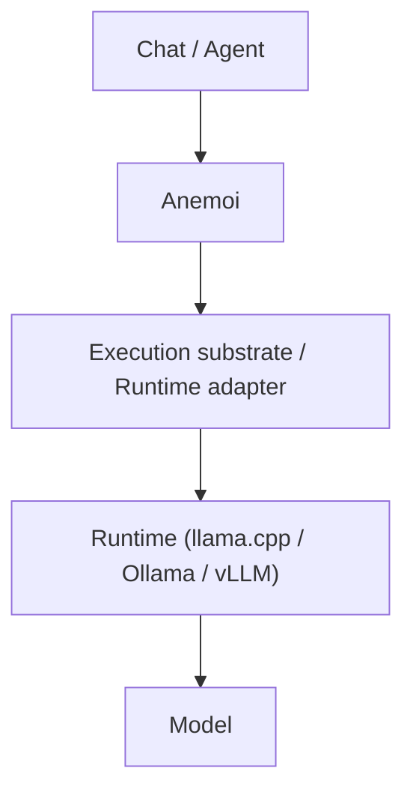

# Anemoi

Anemoi is a local-first inference governance layer for heterogeneous AI systems.

```text
Anemoi decides.
Runtimes execute.
```

Anemoi provides runtime selection, residency governance, and continuity preservation to ensure deterministic scheduling and transparent decision-making. It ensures that the most efficient execution path is chosen based on residency states, budget constraints, and policy scoring.

## Product Boundary

Anemoi owns the decision logic:
- Request-to-domain-to-roster-to-residency-group scheduling.
- Model residency state normalization (`cold`, `loading`, `warm_cpu`, `partial`, `hot_gpu`, `serving`, `draining`, `evicting`, `failed`).
- Runtime inspection through adapters.
- Policy scoring and continuity fallback.
- Decision telemetry and structured explanations.

Anemoi is **not** an inference runtime, model host, provider gateway, or agent framework.

## System Position



## Scheduling Model

Anemoi schedules against residency groups, not raw model names:
`Request` $\to$ `Domain` $\to$ `Roster` $\to$ `Residency Group` $\to$ `Profile` $\to$ `Runtime`

## Workspace

| Crate | Responsibility |
|---|---|
| `anemoi-core` | Domain types, config, residency states, decisions, explanations. |
| `anemoi-runtime` | Runtime adapter trait and inspection adapters (Mock, LlamaSwap, Ollama, LlamaCpp). |
| `anemoi-policy` | Deterministic scheduling, scoring, and continuity behavior. |
| `anemoi-telemetry` | Decision logs and runtime/event telemetry. |
| `anemoi-daemon` | Axum local control-plane API. |
| `anemoi-cli` | Operator commands (`status`, `decide`, `explain`, `residents`). |
| `anemoi-mcp` | MCP control-plane adapter. |

## API

| Endpoint | Purpose |
|---|---|
| `GET /health` | Basic daemon health. |
| `GET /status` | Runtime and policy summary. |
| `GET /residents` | Current normalized residency view. |
| `POST /decide` | Return a decision without executing inference. |
| `POST /execute` | Decide, record, and return a model-load handoff response. |
| `GET /decisions/:id` | Fetch a recorded decision. |
| `GET /explain/:id` | Fetch the explanation for a recorded decision. |

## Configuration & Execution

Default config: `config/anemoi.example.yaml`

**Start the daemon:**
```powershell
cargo run -p anemoi-daemon
```

**Run CLI commands:**
```powershell
cargo run -p anemoi-cli -- status
cargo run -p anemoi-cli -- residents
cargo run -p anemoi-cli -- decide --domain coding --latency-budget-ms 1500
```

## Development & Validation

```powershell
cargo test --workspace
cargo clippy --workspace --all-targets -- -D warnings
```

## Repository State

- **Rust Workspace**: Active in `crates/anemoi-*`.
- **Legacy Surface**: `.NET`/C# files in `src/Anemoi.*` and `Anemoi.sln` are present and marked as `Needs validation`.
- **Local-First**: By default, services bind to loopback.

## References
- `AGENTS.md`
- `CONTRIBUTING.md`
- `config/anemoi.example.yaml`
- `docs/test_roadmap.md`
